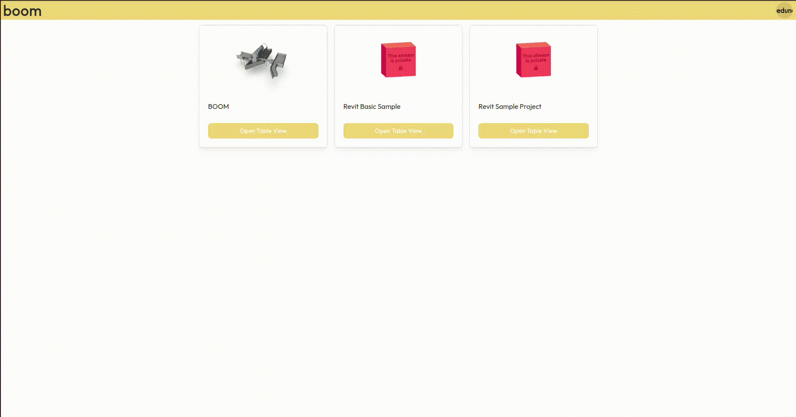

# BOOM Speckle
Bill Of Open Materials - A quantity take-off app for Speckle



Quantity take-offs is an intermediate step between your BIM model and analyses like LCA and cost calculations.\
Instead of doing your schedules in Revit, you can use boom to create quantity take-offs directly from Speckle.

## Getting Started

### Prerequisites

- [Node.js](https://nodejs.org/en/) (version 18 or higher)

### Installation

To get started, clone this repository and install the dependencies:

```bash
git clone https://github.com/ocni-dtu/boom-speckle.git
cd boom-speckle
npm install
```

### Configuration

The application requires a Speckle Server to be running and a [Speckle Application](https://speckle.guide/dev/apps.html)
to be configured on the server. The application will use the `http://localhost:8000` URL by default, so make sure to
configure the application with this URL.

This template uses the main [Speckle Server](https://speckle.xyz) by default. To use a different server, you can change
the `VITE_SPECKLE_SERVER_URL` environment variable in the `.env` file.

To use your own Application, you can change the `VITE_SPECKLE_APP_ID` and `VITE_SPECKLE_APP_SECRET` environment variables in
the `.env` file. You will have to configure the Speckle Application redirect URL to `http(s)://<your-app-url>/auth`.

## Application Structure

The application is structured as follows:

- `src/components` - contains the React UI components.
- `src/contexts` - contains React Context objects used to share authentication across the application
- `src/pages` - contains pages for the app
- `src/queries` - contains GraphQL queries/mutations, together with autogenerated hooks to interact with Speckle's API
- `src/main.tsx` - the application entrypoint

## Available Scripts

In the project directory, you can run:

### `npm dev`

Runs the app in the development mode.\
Open [http://localhost:8000](http://localhost:8000) to view it in the browser.

The page will reload if you make edits.

### `npm codegen`

Generate hooks from `src/queries/queries.graphql` to use in the app

### `npm build`

Builds the app for production to the `dist` folder.\

The build is minified and the filenames include the hashes.\
Your app is ready to be deployed!

